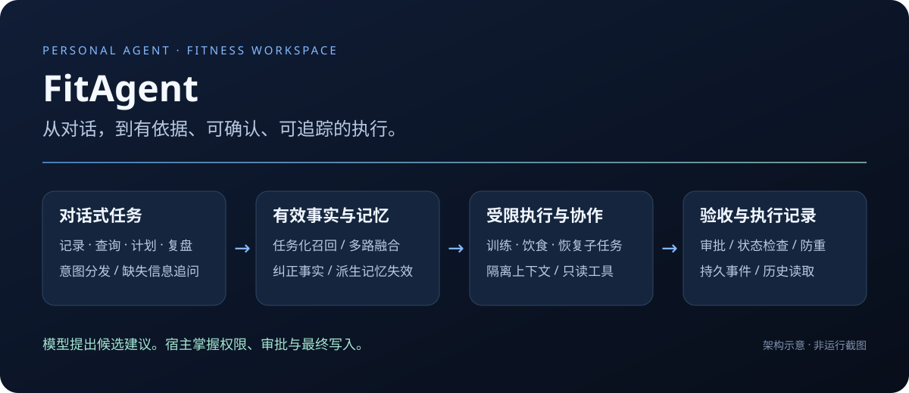
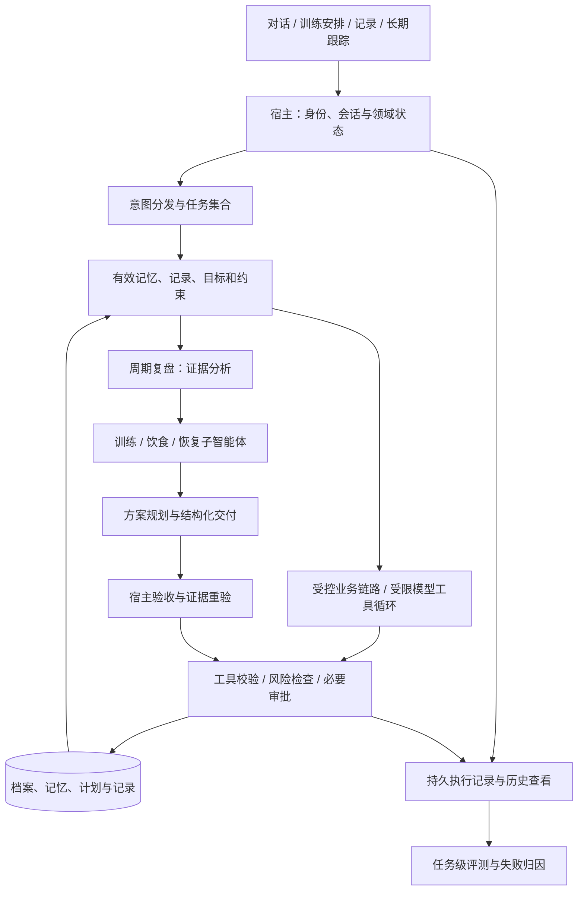
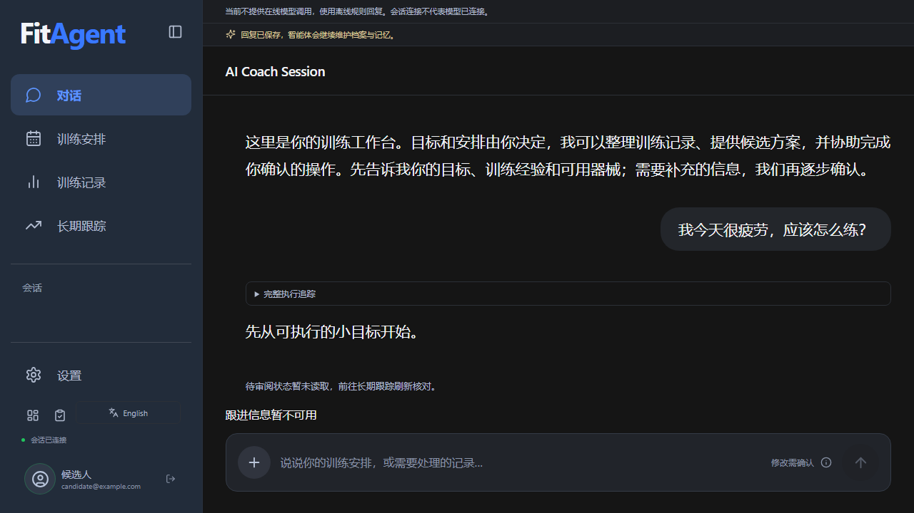
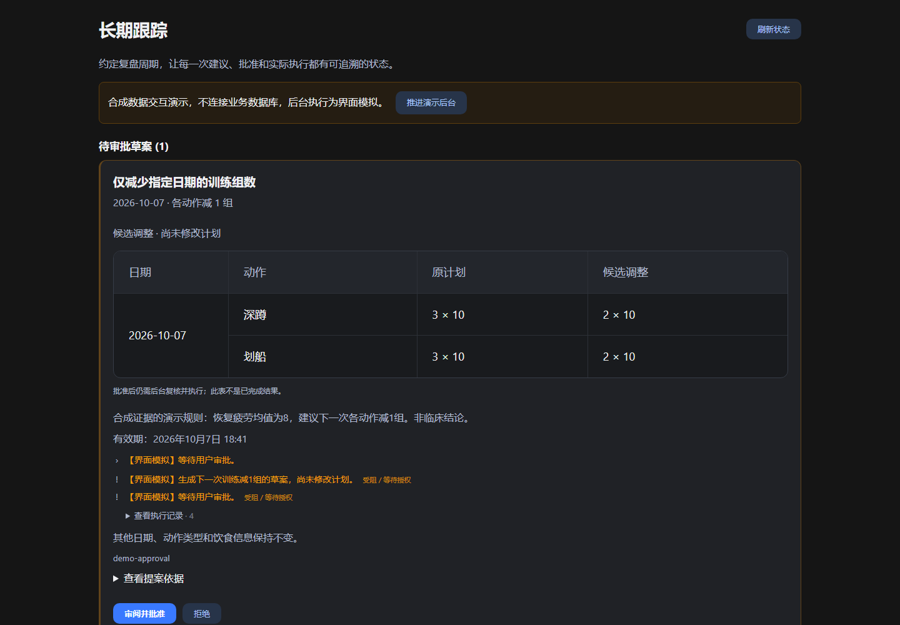

# FitAgent · 面向健身需求的 Personal Agent



**通过对话记录训练、查询历史、复盘近期状态，并在你的确认下调整计划。**

FitAgent 是面向训练、饮食与恢复管理的 Personal Agent（个人智能体）。它把长期目标、近期记录与可纠正记忆接入建议和执行流程：不是只生成一段健身回答，而是让建议有依据、操作有边界、过程可追踪。

**模型负责理解与候选建议，宿主负责权限、状态、审批和执行验收。**

[本地运行](docs/GETTING_STARTED.md) · [架构与源码](docs/ARCHITECTURE.md) · [演示与验收](docs/SHOWCASE.md) · [自带模型密钥](docs/MODEL_ACCESS.md)

## 用户可以做什么？

| 场景 | 交互示例 | 系统处理 |
| --- | --- | --- |
| 记录与查询 | “今天练了40分钟；查一下最近的训练。” | 采集信息，必要时追问，保存训练记录并支持查询 |
| 个性化计划 | “每周练三次，周二只跑步，不安排推举。” | 结合档案、历史与约束生成候选计划；限定日期的变更检查修改范围 |
| 信息纠正 | “昨天其实是20分钟，之前记错了。” | 需要明确记录与确认；更新事实，使旧记忆与相关派生判断失效 |
| 周期复盘 | “结合最近训练、饮食和恢复情况，复盘这周。” | 证据分析、领域子任务和方案规划协作，交付带依据的建议 |
| 长期跟踪 | 查看目标、待审批调整与执行历史 | 保存责任及审批状态，支持跟进、暂停与取消；后台需单独启动 |

这是支持的场景类别，不是任意表达均已验收或全部健身功能覆盖的承诺。饮食与恢复同时提供独立记录入口；对话纠正有明确的记录、字段与确认范围。

## 四条技术主线

### 对话式业务执行：把语言接到业务状态

意图路由复用本轮任务集合，工具统一声明参数、权限与前置条件。明确记录、纠正和确认走受控业务路径；开放对话另有受限的模型选工具循环。缺失信息时先追问，模型建议不等于业务写入。

默认采用轻量分发，不让每次请求依次运行四层分类器。语义辅助与 Jev（类型化决策模型）可选，不配置也能运行。

[业务入口](fast_api/app/services/coach_agent.py) · [执行控制](fast_api/app/services/agent_runtime.py) · [工具分发](fast_api/app/services/agent_tool_dispatcher.py) · [模型工具循环](fast_api/app/services/llm_agent.py) · [路由取舍](docs/LIGHTWEIGHT_DELEGATION_20261004.md)

### 事实召回与长期记忆：相似不等于适用

RAG（检索增强生成）服务于当前任务：区分事实、经验、观察与归纳，按任务选择记忆；向量、关键词、实体与时间多路召回，结合 BM25（关键词相关性评分）、RRF（多路排序融合）及重要性、时效性、适用性综合排序。

用户更正后，旧事实退出默认召回，依赖它的派生记忆沿来源关系失效；历史依据保留。没有向量服务时走词法降级路径，不把降级结果标为语义检索成功。

[记忆读写与检索](fast_api/app/services/memory_system.py) · [任务化召回](fast_api/app/services/memory_planner.py) · [依赖失效](fast_api/app/services/memory_dependencies.py) · [上下文构建](fast_api/app/services/context_builder.py)

### 多智能体协作：分工，也约束交付

训练、饮食与恢复子智能体使用隔离上下文和只读工具。周期复盘按“证据分析 → 领域建议 → 方案规划”交接，共享调用预算；宿主验收结构化结果，重新读取证据检查变化。前置任务失败、证据变化或刷新失败时阻断后续方案，子任务不能批准自己或直接修改计划。

这是有边界的协作，不是多个角色自由聊天。离线模式明确显示跳过，不冒充真实模型完成；不宣称多智能体优于单智能体的量化收益。

[领域子智能体](fast_api/app/services/domain_subagents.py) · [复盘交接](fast_api/app/services/review_collaboration.py) · [生命周期](fast_api/app/services/subagent_runtime.py) · [持久目录](fast_api/app/services/subagent_journal.py)

### 安全控制与任务级评测：检查任务是否真的完成

检查账号归属、工具参数和前置依赖；计划变更设置必要审批、版本冲突与重复执行保护。任务级评测检查回答依据、执行路径及最终业务状态，覆盖记忆纠错、协作交接、工具异常与中断。

模型调用、工具结果及子任务事件形成持久记录，前端以折叠时间线和历史面板展示。回放只读取记录，不自动重新执行；不展示隐藏推理，也不承诺精确重建每次模型上下文。

[审批](fast_api/app/services/approval_manager.py) · [追踪读取](fast_api/app/services/execution_trace.py) · [前端时间线](web/src/ExecutionTimeline.tsx) · [任务级验收](algorithm/evaluation/fitagent_journey_eval.py) · [追踪边界](docs/EXECUTION_TRACE_GUIDE_20261004.md)

## 架构一览



两条执行路径共用宿主权限边界，不是所有请求都运行复盘协作。子任务只交付建议，最终业务写入留在宿主。

## 页面预览



当前原有前端的合成演示截图，展示界面组织，不是实时模型调用或业务验收结果。页面还提供训练安排、训练记录、长期跟踪、设置与开发诊断。

<details>
<summary>展开：计划调整如何先审阅、再批准</summary>



该页面使用内置合成数据，不连接业务数据库。批准与执行是不同状态，候选调整不代表已经修改计划。

</details>

操作步骤与证据边界见[演示指南](docs/SHOWCASE.md)。

## 本地使用：不需要租服务器

完整业务可在自己的电脑运行；调用远程模型不要求本机显卡。不提供共享密钥、免费额度或常驻公共服务。

准备 Python（后端运行环境）3.11/3.12、Node.js（前端构建环境）20.19 及以上兼容版本，以及专用于本项目的 PostgreSQL（关系数据库）空库。完整安装步骤见[快速开始](docs/GETTING_STARTED.md)。

```powershell
git clone https://github.com/threeing3/fitagents.git
cd fitagents
# 按快速开始安装依赖、构建前端并准备新数据库后：
python -m scripts.run_local_byok --provider offline --ack-db-migrations
# 使用真实模型，替换为自己账号可用的模型名称：
python -m scripts.run_local_byok --provider deepseek --model YOUR_MODEL_ID --ack-db-migrations
```

启动入口隐式询问数据库连接串及密钥；确认参数表示允许迁移所选数据库，不要指向未经备份审计的重要旧库。只监听本机，打开 <http://127.0.0.1:8015/> 注册使用。不自动启动后台工作进程，默认关闭远程向量调用与第三方追踪。

离线模式用于检查规则与业务状态，不能证明模型理解、语义召回或多智能体质量。自带密钥是单部署配置，不是公网逐用户配置密钥的托管服务。

## 如何检查项目，而不只看截图？

| 想检查什么 | 阅读与复现入口 |
| --- | --- |
| 对话如何成为工具执行 | [执行控制](fast_api/app/services/agent_runtime.py)、[工具循环](fast_api/app/services/llm_agent.py) |
| 纠正后旧结论为何失效 | [依赖失效测试](tests/test_memory_dependencies.py)、[记忆评测集](tests/evals/hindsight_memory_eval_cases.json) |
| 子任务有没有真实权限边界 | [领域测试](tests/test_domain_subagents.py)、[子任务运行测试](tests/test_subagent_runtime.py) |
| 任务是否真的完成 | [固定合成业务链路](algorithm/evaluation/fitagent_journey_eval.py)、[工具循环评测](algorithm/evaluation/tool_loop_task_eval.py) |
| 中断和历史记录怎样呈现 | [追踪指南](docs/EXECUTION_TRACE_GUIDE_20261004.md)、[验收矩阵](docs/TRACE_ACCEPTANCE_MATRIX_20261005.md) |

脚本化模型用于协议与故障测试，真实模型评测检查模型行为，二者分别记账。历史验收有版本和范围，不将测试数量当作用户效果或线上稳定性指标。详见[展示与验证](docs/SHOWCASE.md)。

## 目录导航

```text
fast_api/app/services/  对话执行、记忆、领域子任务、审批与长期责任
fast_api/app/api/       登录账号范围内的业务与追踪接口
web/src/               产品页面、执行时间线与历史追踪
algorithm/evaluation/  模型与任务级评测
tests/                 回归、隔离、交接与故障测试
scripts/               本地运行与专项验收
docs/                  架构、复现、决策与验收范围
```

## 边界与参考

个人开发项目，不提供医疗诊断，不代替医生或专业训练指导。当前结合受控工作流、受限模型工具循环和领域子智能体，不是开放式通用自主执行系统。没有公网容量承诺，也未完成多智能体优于单智能体的公平效果对照。

追踪与子任务生命周期设计参考 [DeepSeek Harness（智能体执行框架）](https://github.com/deepseek-ai/deepseek-harness) 的职责分离；展示组织参考 [Dify](https://github.com/langgenius/dify)、[Open WebUI](https://github.com/open-webui/open-webui) 和 [Open Deep Research](https://github.com/langchain-ai/open_deep_research)。这些是设计参考，不宣称相同完整性或复制其代码。
