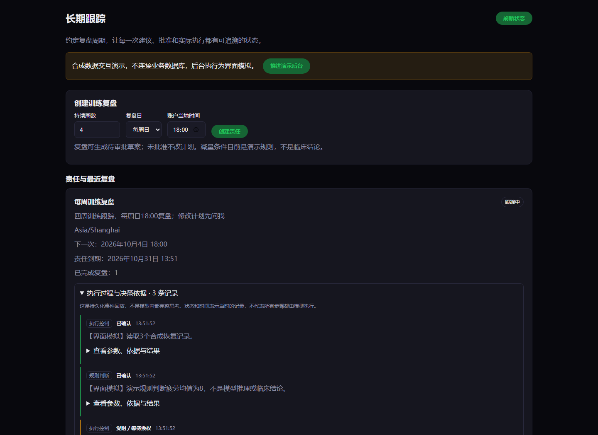
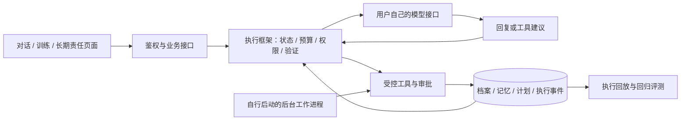

# FitAgent · 把健身建议变成可追踪的行动

面向健身场景的长期陪伴智能体：理解目标、维护可纠正记忆、安排训练、跟进反馈，并在需要修改计划时征求批准。

**模型提出建议，执行框架控制状态与写入。** 重点不是“能聊健身”，而是目标、日期、权限、记忆更正和执行结果能否对齐。

[快速开始](docs/GETTING_STARTED.md) · [架构](docs/ARCHITECTURE.md) · [自带模型密钥](docs/MODEL_ACCESS.md) · [展示与验证](docs/SHOWCASE.md)



*原有前端的合成数据演示：展示责任、审批和执行事件的界面组织，不连接业务数据库，不代表真实模型或后台执行结果。*

## 使用场景

> “未来四周每周训练三次，周二只做跑步，不要安排推举。昨天其实训练了 20 分钟，之前记错了。”

目标和约束进入长期状态；更正需要明确训练记录和确认；旧事实与受影响的后续判断同步失效；计划调整先进入审批，而不是悄悄覆盖其他日期。

这是多项能力组成的场景说明，不代表任意自然语言表达都已通过端到端验收。更正对话目前支持明确目标的限定表达。

## 核心能力

| 能力 | 解决的问题 | 源码入口 |
| --- | --- | --- |
| 受控执行 | 模型建议不等于允许写入，检查权限、预算及前置条件 | [执行框架](fast_api/app/services/agent_runtime.py)、[工具分发](fast_api/app/services/agent_tool_dispatcher.py) |
| 长期责任 | 四周目标需要跟进、批准、暂停及到期 | [责任状态](fast_api/app/services/responsibilities.py)、[审批](fast_api/app/services/approval_manager.py) |
| 可纠正记忆 | 用户改口后旧事实不能继续影响建议 | [记忆](fast_api/app/services/memory_system.py)、[依赖失效](fast_api/app/services/memory_dependencies.py) |
| 有边界的计划更新 | 遵守指定日期、运动类型和禁忌，保留其他部分 | [日期变更](fast_api/app/services/dated_plan_changes.py)、[运动约束](fast_api/app/services/exercise_constraints.py) |
| 训练记录更正 | 防止改错记录、重复写入及覆盖新版本 | [更正服务](fast_api/app/services/workout_corrections.py)、[原有页面](web/src/WorkoutCorrectionPanel.tsx) |
| 执行回放 | 展示工具、验证、审批和恢复，不展示隐藏思维 | [执行事件](fast_api/app/services/execution_events.py)、[时间线](web/src/ExecutionTimeline.tsx) |

## 架构



单智能体与业务服务编排的混合架构：确定性路径处理明确写操作，模型处理语言理解和建议。不是让模型任意修改数据库，也不是多个角色互相聊天。

前端使用 React（组件化页面框架）；后端使用 FastAPI（接口服务框架）；数据使用 PostgreSQL（关系数据库），可选 pgvector（向量检索扩展）。

## 不租服务器，能否使用？

**仓库展示不需要服务器，完整业务可以在用户本机运行。** 使用远程模型接口时，不需要本机显卡。

| 方式 | 服务器要求 | 模型密钥 |
| --- | --- | --- |
| 阅读首页、架构、测试说明 | 无 | 无 |
| 本地离线体验页面与规则 | 本地后端与数据库，不需租用 | 无 |
| 本地使用真实模型 | 本地后端与数据库，不需租用 | 用户自己提供并承担费用 |
| 公网多人使用完整业务 | 常驻后端、数据库和安全配置 | 自带密钥不能替代基础设施 |

不提供共享模型密钥、免费额度或承诺持续在线的公共服务。静态托管页面不能运行数据库和后台任务。

## 自带密钥运行

新入口不复用已有模型密钥。用户在自己的终端隐式输入，仅用于该服务进程；不写入配置文件或浏览器存储。

```powershell
# 先按快速开始安装依赖、构建原有页面并准备自己的新数据库。
# 确认参数表示允许应用在所选数据库执行迁移。
python -m scripts.run_local_byok --provider qwen --model YOUR_MODEL_ID --ack-db-migrations
```

也可选 `deepseek` 或 `offline`（离线规则模式）。真实模式必须输入非空密钥。新入口关闭远程向量与第三方追踪，不自动启动后台工作进程。详见[密钥边界](docs/MODEL_ACCESS.md)。

## 如何验证，不只看演示

测试覆盖旧记忆失效、批准前禁止写入、重复提交不重复执行、过期版本冲突、跨账号访问拒绝、日期和运动约束、流式回复约束检查。

近期本地全量后端记录为 **1315 项通过、2 项跳过**，另完成原有页面与真实本地数据库的训练更正和重复提交验收。这些是特定版本的本地结果，不是临床效果、线上收益或高并发承诺。新增入口的测试单独记录。

[交付记录](docs/FITAGENT_DELIVERY_20261003.md) · [验收范围](docs/FITAGENT_FINAL_SCOPE_AUDIT_20261003.md) · [测试目录](tests/)

## 项目导航

```text
fast_api/app/services/  执行控制、记忆、计划、审批与责任
fast_api/app/api/       登录用户的业务接口
web/src/               原有产品页面与执行时间线
algorithm/evaluation/  模型对比与任务链路评测
scripts/               本地启动、验收与数据库审计
tests/                 权限、状态一致性与业务回归
docs/                  架构、复现与范围说明
```

## 边界与参考

开发中的个人项目，不提供医疗诊断，也不能代替专业教练或医生。现有服务仍是**单个本地部署使用一套模型配置**，不是公网逐用户提交密钥的托管服务。跨进程写入有专项验证，尚无容量承诺。

展示组织参考 [Dify](https://github.com/langgenius/dify) 的能力导航、[Open WebUI](https://github.com/open-webui/open-webui) 的自托管说明和 [Open Deep Research](https://github.com/langchain-ai/open_deep_research) 的架构与复现组织；未复制这些项目的代码。
