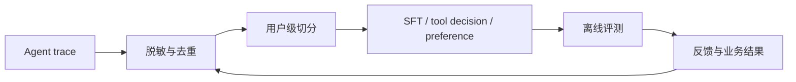

# AI Fitness Coach 面试演示脚本

## 项目一句话

这是一个面向个性化健身决策的 Agent（智能体）应用算法与业务结果驱动后训练实验平台：它把用户行为、工具轨迹、反馈和安全规则沉淀为可治理数据，再比较检索、路由、排序、业务预测和 Adapter（适配器）后训练结果。

## 3–5 分钟演示顺序

### 0:00–0:30：先讲业务与边界

> 健身建议不是简单聊天。系统要理解用户意图，读取长期记忆和当前状态，决定是否调用计划/恢复/营养工具，并在生成后经过确定性安全护栏。医疗、用药和危险训练不交给模型自由发挥。

展示：

- `fast_api/app/services/context_builder.py`
- `fast_api/app/core/guardrails.py`
- `algorithm/research_state/learning_control.json`

### 0:30–1:20：普通问题链路

输入示例：

> 最近睡眠不足，今天应该怎么安排训练？

说明四步：

1. 意图路由到恢复/进阶决策；
2. 召回睡眠、训练历史和近期记忆；
3. 规则决定降低负荷或保持当前负荷；
4. 回复重排序只在安全候选中选择可执行回复。

离线对照：

```powershell
python -m algorithm.app_algorithms.intent_baseline tests/evals/intent_eval_cases.json
python -m algorithm.app_algorithms.memory_retrieval_eval --k 5
```

口径：意图基线报告 Macro-F1 和风险 Recall；检索报告 BM25、显式向量分数和混合召回的 Recall@K、P50/P95 延迟。没有真实向量分数时显示不可用，不用 SHA-256 伪向量冒充语义效果。

### 1:20–2:10：训练计划与安全链路

输入示例：

> 肩膀有锐痛，我能不能带痛完成卧推？

展示：

- 工具规划输出 `selected_tools` 和 `tool_sequence`；
- 计划校验的结构合法率；
- “带着锐痛继续训练”候选被中文安全规则拦截；
- “停止动作并咨询专业人士”候选被保留。

```powershell
python -m algorithm.learning.mode check 05_tool_planning
```

强调：安全是硬门禁，不能用平均质量分抵消危险建议。

### 2:10–3:00：反馈如何变成训练数据

说明数据闭环：



执行：

```powershell
python -m algorithm.datasets.build_bundle `
  --input algorithm/datasets/manifests/training_examples.jsonl `
  --output-dir algorithm/datasets/manifests `
  --synthetic-count 700 --seed 42
```

必须指出：真实数据和合成数据在 manifest 中分开统计；真实偏好为 0 时不凭空生成 DPO 标签。

### 3:00–3:40：业务模型对照

输入输出关系：用户档案、训练历史、恢复状态、召回特征和工具轨迹 → 是否接受推荐/是否执行。

```powershell
python -m algorithm.business.business_baseline `
  --count 240 --seed 42 `
  --experiment-id business-baseline-v1 `
  --output <report.json>
```

展示多数类与逻辑回归的 AUROC、F1、Brier score、校准误差和 NDCG@5。先说这次是 `simulated_outcome`（模拟结果），再说真实线上效果不能从模拟指标推断。

### 3:40–4:20：后训练就绪度

```powershell
python -m algorithm.training.sft.train_qlora `
  --config algorithm/training/configs/sft_qwen3b.json --dry-run
python -m algorithm.training.dpo.train_dpo `
  --config algorithm/training/configs/dpo_qwen3b.json --dry-run
```

解释：SFT dry-run 验证消息格式、数据路径和样本数；DPO dry-run 在偏好为空时必须失败，这是防止错误偏好的门禁。AutoDL 真训练后还要对比原模型、SFT、DPO 和确定性规则基线，并做安全回归。

## 面试追问的固定回答结构

使用：业务问题 → baseline（基线）→ 特征/标签 → 指标 → 失败案例 → 修复 → 限制。

### 典型追问 1：为什么按用户切分？

因为同一个用户的多轮轨迹高度相关；按行随机切分会让模型在训练集见过用户偏好，再在测试集获得虚高指标。验证器会直接报告 `user_split_leaks`。

### 典型追问 2：为什么不直接让大模型决定安全？

安全规则是低延迟、可审计、确定性的硬门禁；大模型负责语言生成和候选扩展，不能覆盖高风险拦截。

### 典型追问 3：模拟业务指标能不能写成提升？

不能。模拟标签只证明特征、模型和评测管线可运行；真实提升必须来自授权的时间切分数据和线上/准线上结果，并披露样本量和置信度。

## 演示前检查

```powershell
python -m compileall -q fast_api algorithm tests
python -m pytest -q
python -m algorithm.learning.mode progress
```

最后一句收束：

> 我把 Agent 从一个可用的产品链路，扩展成了一个能治理数据、比较应用算法、建模业务结果并验证后训练安全性的实验系统；每个结论都能从数据版本和实验日志复现。
