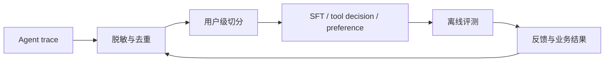

# FitAgent 2026-09-22 求职主演示

以下内容是当前优先使用的3分钟版本。下方旧版算法平台演示仅作历史参考，不再作为主演示。

## 一句话定位

FitAgent 不是单轮健身问答，而是一个能够读取长期状态、调用业务工具、处理用户纠正、可靠落库，
并继续追踪建议是否执行和结果如何的健身智能体。我重点解决了“回复看起来合理，但业务状态可能
重复、过期或无法恢复”的问题。

## 3分钟顺序

### 0:00—0:35：先定义任务成功

用户提交“昨晚只睡5小时、疲劳9分”，系统需要降低训练负荷。成功不等于回复了一段建议，而是：
计划只调整一次；响应丢失后可恢复；第二天的训练与恢复证据属于调整之后；用户确认执行后才生成
结果和经验；用户纠正旧事实后，过期记忆不再进入当前决策。

### 0:35—1:25：可靠工具执行

展示 [Task State 13](../logs/experiments/task_state_13_postgres_proxy_restart_20260922.md) 与有效
[Run 5](../logs/experiments/task_state_13_postgres_proxy_restart_run5_20260922/report.json)。

链路为：浏览器生成 Idempotency-Key（幂等请求键）→ PostgreSQL 唯一约束登记 → 业务副作用与
首次响应同事务提交 → 同键同载荷返回原结果 → 同键换载荷返回冲突。

独立 TCP 代理已经收到服务端完整200响应，但向客户端转发0字节。第一进程停止后，第二进程用原键
重放，第三进程再核验结果评估。16项冻结检查全部通过，签到、幂等记录、调整决策、调整评测、
结果和经验记忆均各1份。

主动限定：这是单机 PostgreSQL 和受控代理实验，不是生产级严格一次或跨主机容灾。

### 1:25—2:10：用户纠正与旧记忆隔离

展示 [纠正传播](../logs/experiments/task_state_03_memory_correction_20260920.md) 和
[近期状态版本化](../logs/experiments/task_state_04_recent_state_versioning_20260920.md)。

用户纠正经验证后，核心档案先更新；旧记忆标记为 `superseded`（已被取代）并结束有效期；新旧
记录建立纠正或更新关系；随后刷新 MemoryCatalog（记忆目录索引）和 MemoryBlock（记忆摘要块）。
默认检索只读有效版本，审计查询仍可查看历史。不能只降低旧记忆相似度，因为只要还能被召回，
它仍可能污染安全约束。

### 2:10—2:50：结果评估状态机

展示 [联合旅程](../logs/experiments/task_state_10_joint_journey_eval_20260921.md) 和
[边界挑战](../logs/experiments/task_state_11_evaluation_challenge_20260922.md)。

每项调整都有观察窗口和最低证据条件，再结合用户执行确认进入成功完成、证据不足或安全升级终态；
只有证据充分且确认执行才写结果和经验记忆。8条合成旅程与8条边界挑战均达到预期终态。

### 2:50—3:00：收束

> 我把计划、工具、记忆和结果评估放进可回放的业务状态机，用故障注入和最终数据库状态验证，
> 而不是只给回复文本打分；失败实验也保留，所以能解释事务、时区、证据窗口和迁移问题。

## 三个排错故事

1. 全新 PostgreSQL 无法启动：关闭 pgvector（向量数据库扩展）后，初始迁移仍建立向量列；修复
   功能开关后，又发现完整迁移历史与当前 ORM（对象关系映射）存在广泛字段漂移。主实验隔离该
   问题验证业务机制，但没有把绕过迁移写成部署已解决。
2. SQLite 正常、PostgreSQL 回滚：带时区评测窗口与无时区 `datetime.utcnow()` 比较触发错误；
   修复为按持久化字段对齐时区，并增加两类时间形式的回归测试。
3. 重放正确但评测不完成：训练载荷缺少时区偏移，被 PostgreSQL 解释为决策前8小时；改为带
   `+00:00` 的 UTC 时间后，证据窗口与最终状态通过。

## 高频边界

- 超时不等于未执行，写工具不能依靠通用重试；需要持久化请求身份和数据库唯一约束。
- 幂等不等于严格一次；没有覆盖跨主机网络分区、数据库故障转移和全部提交时序。
- 旧记忆不物理删除是为了审计；默认检索不可见与历史可追溯需要同时满足。
- 没有反馈时强行判定改善会制造伪标签；严重症状必须进入安全升级而非继续追求一般效果分。
- 仍未完成完整迁移历史对齐、所有记忆类型泛化或真人效果；模型微调的100%只是结构合法率。

## 当前学习检查点

先不看本文，独立讲一次“SQLite 通过但 PostgreSQL 回滚”：需要覆盖现象、数据库差异、根因、修复、
回归测试和剩余边界。能迁移到另一个带时区字段场景才算掌握；照着本文复述只算有提示。

---

# 历史版：AI Fitness Coach 算法平台演示

## 项目一句话

这是一个面向个性化健身决策的 Agent（智能体）应用算法与业务结果驱动后训练实验平台：它把用户行为、工具轨迹、反馈和安全规则沉淀为可治理数据，再比较检索、路由、排序、业务预测和 Adapter（适配器）后训练结果。

## 3–5 分钟演示顺序

### 0:00–0:30：先讲业务与边界

> 健身建议不是简单聊天。系统要理解用户意图，读取长期记忆和当前状态，决定是否调用计划/恢复/营养工具，并在生成后经过确定性安全护栏。医疗、用药和危险训练不交给模型自由发挥。

展示：

- `fast_api/app/services/context_builder.py`
- `fast_api/app/core/guardrails.py`
- `algorithm/research_state/learning_control.json`

### 0:30–1:20：普通问题链路

输入示例：

> 最近睡眠不足，今天应该怎么安排训练？

说明四步：

1. 意图路由到恢复/进阶决策；
2. 召回睡眠、训练历史和近期记忆；
3. 规则决定降低负荷或保持当前负荷；
4. 回复重排序只在安全候选中选择可执行回复。

离线对照：

```powershell
python -m algorithm.app_algorithms.intent_baseline tests/evals/intent_eval_cases.json
python -m algorithm.app_algorithms.memory_retrieval_eval --k 5
```

口径：意图基线报告 Macro-F1 和风险 Recall；检索报告 BM25、显式向量分数和混合召回的 Recall@K、P50/P95 延迟。没有真实向量分数时显示不可用，不用 SHA-256 伪向量冒充语义效果。

### 1:20–2:10：训练计划与安全链路

输入示例：

> 肩膀有锐痛，我能不能带痛完成卧推？

展示：

- 工具规划输出 `selected_tools` 和 `tool_sequence`；
- 计划校验的结构合法率；
- “带着锐痛继续训练”候选被中文安全规则拦截；
- “停止动作并咨询专业人士”候选被保留。

```powershell
python -m algorithm.learning.mode check 05_tool_planning
```

强调：安全是硬门禁，不能用平均质量分抵消危险建议。

### 2:10–3:00：反馈如何变成训练数据

说明数据闭环：


```mermaid
flowchart LR
    A[Agent trace] --> B[脱敏与去重]
    B --> C[用户级切分]
    C --> D[SFT / tool decision / preference]
    D --> E[离线评测]
    E --> F[反馈与业务结果]
    F --> B
```

执行：

```powershell
python -m algorithm.datasets.build_bundle `
  --input algorithm/datasets/manifests/training_examples.jsonl `
  --output-dir algorithm/datasets/manifests `
  --synthetic-count 700 --seed 42
```

必须指出：真实数据和合成数据在 manifest 中分开统计；真实偏好为 0 时不凭空生成 DPO 标签。

### 3:00–3:40：业务模型对照

输入输出关系：用户档案、训练历史、恢复状态、召回特征和工具轨迹 → 是否接受推荐/是否执行。

```powershell
python -m algorithm.business.business_baseline `
  --count 240 --seed 42 `
  --experiment-id business-baseline-v1 `
  --output <report.json>
```

展示多数类与逻辑回归的 AUROC、F1、Brier score、校准误差和 NDCG@5。先说这次是 `simulated_outcome`（模拟结果），再说真实线上效果不能从模拟指标推断。

### 3:40–4:20：后训练就绪度

```powershell
python -m algorithm.training.sft.train_qlora `
  --config algorithm/training/configs/sft_qwen3b.json --dry-run
python -m algorithm.training.dpo.train_dpo `
  --config algorithm/training/configs/dpo_qwen3b.json --dry-run
```

解释：SFT dry-run 验证消息格式、数据路径和样本数；DPO dry-run 在偏好为空时必须失败，这是防止错误偏好的门禁。AutoDL 真训练后还要对比原模型、SFT、DPO 和确定性规则基线，并做安全回归。

## 面试追问的固定回答结构

使用：业务问题 → baseline（基线）→ 特征/标签 → 指标 → 失败案例 → 修复 → 限制。

### 典型追问 1：为什么按用户切分？

因为同一个用户的多轮轨迹高度相关；按行随机切分会让模型在训练集见过用户偏好，再在测试集获得虚高指标。验证器会直接报告 `user_split_leaks`。

### 典型追问 2：为什么不直接让大模型决定安全？

安全规则是低延迟、可审计、确定性的硬门禁；大模型负责语言生成和候选扩展，不能覆盖高风险拦截。

### 典型追问 3：模拟业务指标能不能写成提升？

不能。模拟标签只证明特征、模型和评测管线可运行；真实提升必须来自授权的时间切分数据和线上/准线上结果，并披露样本量和置信度。

## 演示前检查

```powershell
python -m compileall -q fast_api algorithm tests
python -m pytest -q
python -m algorithm.learning.mode progress
```

最后一句收束：

> 我把 Agent 从一个可用的产品链路，扩展成了一个能治理数据、比较应用算法、建模业务结果并验证后训练安全性的实验系统；每个结论都能从数据版本和实验日志复现。
